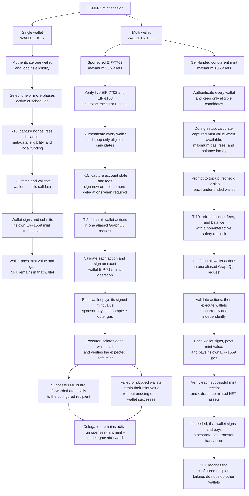

<p align="center">
  
</p>

<h1 align="center">drizzy</h1>

<h3 align="center">SeaDrop mint sniper — fast on-chain public mints + Telegram bot control</h3>

---

<h2 align="center">Overview</h2>

drizzy combines two minting engines in one Rust binary:

- **`opensea-mint snipe`** — the fast path for public SeaDrop stages: `mintPublic`
  calldata is built from on-chain state (no OpenSea token, no rate limits, no API
  round-trip on the critical path). Every wallet transaction is pre-signed before
  the stage opens and blasted to all RPCs in parallel at T-0.
- **`opensea-mint mint`** — the full OpenSea API path for single, multi-wallet,
  and sponsored EIP-7702 mints (allowlist/FCFS included).
- **`opensea-mint bot`** — an owner-only Telegram bot that drives the sniper:
  wizard-driven snipes, wallet listing, and `wallets.json` upload import. Private
  keys never appear in chat; the fire stays server-side at T-0.

The `mint` engine is a cross-platform Rust minting CLI for OpenSea-hosted SeaDrop NFT collections on OpenSea-supported EVM chains matching the configured RPC. It discovers the collection, authenticates each configured wallet, verifies eligibility, and supports one or more allowlist (WL), first-come-first-served (FCFS), and public phases. Users can mint in **single-wallet mode** or **multiple-wallet mode**, execute concurrent **self-funded multi-wallet** mints, sponsor multi-wallet gas through **EIP-7702 sponsored mode** on compatible chains, and fund up to 10 self-funded manifest wallets atomically in one verified Multicall3 transaction when the canonical deployment is available. Multi-phase selections execute sequentially by start time, and `SPONSORED=true` deliberately selects `WALLETS_FILE` when both wallet sources are configured.



| Wallet mode | Who pays? | Transactions | NFT destination | Failure boundary |
| --- | --- | --- | --- | --- |
| **Single wallet**<br/>`WALLET_KEY` | The configured wallet pays its mint value and gas | One independently signed mint transaction per selected phase | Remains in the configured wallet | That wallet and phase only |
| **Multiple wallets: sponsored EIP-7702**<br/>`WALLETS_FILE` + `SPONSORED=true` | Each manifest wallet pays its own mint value; `SPONSOR_KEY` pays the complete batch gas | One executor batch per selected phase, carrying authorizations for wallets that need a new or replacement delegation | Forwarded atomically to `RECIPIENT_ADDRESS`, or the sponsor fallback | One wallet can fail without stopping the others; outer execution failure reverts contract execution and value movement, but processed delegations may persist |
| **Multiple wallets: self-funded concurrent**<br/>`WALLETS_FILE` + `SPONSORED=false` | Every manifest wallet pays its own mint value, mint gas, and forwarding gas | Independent wallet transactions run concurrently, followed by safe-transfer transactions when the recipient differs | Forwarded after receipt verification to `RECIPIENT_ADDRESS`, or the sponsor fallback | Each wallet succeeds or fails independently |

The integrated [`SponsoredMintExecutor`](contracts/README.md) is used only by **sponsored EIP-7702 mode**. **Self-funded multi-wallet mode** does not delegate wallets or call the executor. Its interactive funding and top-up gate runs during setup, before approval or scheduling. T-10 and final pre-signing checks are non-interactive safety rechecks; a wallet is skipped only if its balance or required cost became insufficient after setup. EIP-7702 delegation can remain after success or failure, so sponsored users must run `opensea-mint mint --undelegate` and verify revocation.

> [!IMPORTANT]
> `SPONSORED=true` sponsors the on-chain transaction gas only. Every eligible wallet must hold `eligible mint price × its configured quantity`, plus the local OpenSea action-construction reserve calculated as `GAS_LIMIT × maximum configured fee per gas`. OpenSea may reject wallet-specific calldata construction without that reserve even for a free sponsored mint. The executor spends only the validated mint value from the wallet, so the unused reserve remains there; the sponsor pays EIP-7702 authorization processing, batch execution, mint-call gas, NFT verification, and forwarding gas. Setup verifies both balances before approval.

> [!CAUTION]
> This project uses OpenSea's private, unstable web API and trusts opaque transaction data returned by OpenSea. It is experimental and high risk. Use only dedicated wallets funded with the amount required for the intended mint.

---

<h2 align="center">Quick Start</h2>

### 1. Installation

The repository requires Git, Rust, and a native C/C++ compiler. Clone and compile it on the operating system where it will run.

#### **Windows**

Install [Visual Studio Build Tools](https://visualstudio.microsoft.com/visual-cpp-build-tools/) with **Desktop development with C++**, [Git for Windows](https://git-scm.com/downloads/win), and [Rust](https://www.rust-lang.org/tools/install). Reopen PowerShell, then run:

```powershell
git clone https://github.com/zunmax/osnm-z.git
Set-Location osnm-z
cargo install --path . --locked
opensea-mint --version
```

#### **Linux or WSL**

Install the prerequisites for the distribution:

**Ubuntu or Debian:**

```bash
sudo apt-get update
sudo apt-get install -y build-essential curl ca-certificates git
```

**Fedora or RHEL:**

```bash
sudo dnf install -y gcc gcc-c++ make curl ca-certificates git
```

**Arch Linux:**

```bash
sudo pacman -S --needed base-devel curl ca-certificates git
```

Install Rust, clone the repository, and install the CLI:

```bash
curl --proto '=https' --tlsv1.2 -sSf https://sh.rustup.rs | sh
source "$HOME/.cargo/env"
git clone https://github.com/zunmax/osnm-z.git
cd osnm-z
cargo install --path . --locked
opensea-mint --version
```

#### **macOS**

Install Apple's command-line developer tools, then install Rust and the CLI:

```bash
xcode-select --install
curl --proto '=https' --tlsv1.2 -sSf https://sh.rustup.rs | sh
source "$HOME/.cargo/env"
git clone https://github.com/zunmax/osnm-z.git
cd osnm-z
cargo install --path . --locked
opensea-mint --version
```

### 2. Set Up `.env` and `wallets.json`

Create the active environment file:

```powershell
# Windows PowerShell
Copy-Item .env.example .env
```

```bash
# Linux or macOS
cp .env.example .env
```

Keep the shared settings and select one wallet mode.

```dotenv
RPC_URL=https://your-chain-rpc.example
FEE_AUTOMATIC=true
GAS_LIMIT=300000
```

**Single-wallet mode:**

```dotenv
WALLET_KEY=0x<64-hex-character-private-key>
```

**Multiple-wallet mode: self-funded:**

```text
opensea-mint wallets create --count 10 --quantity 1 --output wallets.json
```

```dotenv
# Remove or comment WALLET_KEY from the copied example.
WALLETS_FILE=wallets.json
SPONSORED=false
RECIPIENT_ADDRESS=0x<40-hex-character-recipient-address>
# SPONSOR_KEY=0x<required-only-for-funding-or-recipient-fallback>
```

**Multiple-wallet mode: sponsored EIP-7702:**

```text
opensea-mint wallets create --count 25 --quantity 1 --output wallets.json
```

```dotenv
# Remove or comment WALLET_KEY from the copied example.
WALLETS_FILE=wallets.json
SPONSORED=true
SPONSOR_KEY=0x<64-hex-character-sponsor-private-key>
RECIPIENT_ADDRESS=0x<40-hex-character-recipient-address>
# Add SPONSORED_EXECUTOR_ADDRESS after running deploy-executor.
```

```text
opensea-mint deploy-executor
```

Copy the printed executor address into `.env` as `SPONSORED_EXECUTOR_ADDRESS=0x...`. Keep `.env` and `wallets.json` private; both contain private keys.

### 3. Run the Command

Validate the selected mode, then start the interactive mint session:

```text
opensea-mint doctor
opensea-mint mint
```

If the installed command is unavailable, run the same arguments through Cargo from the repository root:

```text
cargo run --release --locked -- doctor
cargo run --release --locked -- mint
```

To use the direct release binary, build it once. On Windows PowerShell:

```powershell
cargo build --release --locked
.\target\release\opensea-mint.exe doctor
.\target\release\opensea-mint.exe mint
```

On Linux or macOS:

```bash
cargo build --release --locked
./target/release/opensea-mint doctor
./target/release/opensea-mint mint
```

---

<h2 align="center">Deploy on Railway</h2>

The repository ships a multi-stage `Dockerfile` (auto-detected by Railway) plus a
`railway.toml` that runs the bot as a worker. No public domain or port is
needed — the bot long-polls Telegram, so there is nothing to expose.

### 1. Create the service

1. Push `Savage27z/drizzy` to GitHub.
2. Railway: **New Project → Deploy from GitHub repo** → pick `drizzy`.
3. The Dockerfile builds automatically. First build compiles every Rust
   dependency (~10 min, `aws-lc-sys` is the heavy one); redeploys only rebuild
   drizzy itself (~2 min) thanks to the cached builder stage.

### 2. Add a Volume

Mount a Railway **Volume** at `/data` so the wallet manifest survives restarts
and redeploys. Set `WALLETS_FILE=/data/wallets.json` (the manifest path is
already env-configurable — no code change needed).

### 3. Environment variables

| Setting | Required | Purpose |
| --- | --- | --- |
| `BOT_TOKEN` | ✅ | Bot token from [@BotFather](https://t.me/BotFather). |
| `ALLOWED_CHAT_IDS` | ✅ | Comma-separated numeric chat ids (from [@userinfobot](https://t.me/userinfobot)); every other chat is ignored. |
| `RPC_URL_BOT` | ✅ | Comma-separated RPC endpoints for bot snipes (falls back to `RPC_URL`, then per-chain public nodes). Use a paid node for best T-0 latency. |
| `WALLETS_FILE` | ✅ | `/data/wallets.json` (volume). |
| `FEE_AUTOMATIC` / `GAS_LIMIT` | as needed | Inherited from `.env.example` defaults if unset; see Configuration. |

### 4. First wallet setup

Either generate a manifest from the Railway shell, or upload one in chat:

```bash
# Railway service shell (writes into the persistent volume)
opensea-mint wallets create --count 5 --quantity 1 --output /data/wallets.json
```

Then send the `wallets.json` file to the bot chat (upload import) — keys are
stored server-side and never appear in chat history.

### 5. Run

`railway.toml` starts `opensea-mint bot` automatically. Watch the service logs:
a successful start prints the bot username and the owner-only guard message.
Send `/help` from your allowed chat id to verify.

> [!NOTE]
> Build memory is capped at 2 parallel cargo jobs in the Dockerfile
> (`CARGO_BUILD_JOBS=2`) so `aws-lc-sys` does not OOM a small Railway builder.
> If the build still runs out of memory, lower it to `1` in the Dockerfile
> builder stage.

---

<h2 align="center">Deploy on Zeabur</h2>

Zeabur is a supported alternative to Railway. It auto-detects the same
multi-stage `Dockerfile`, so nothing in the build changes — `railway.toml` is
simply ignored, and the two platforms coexist in this repo.

> [!IMPORTANT]
> **The Free plan will not work.** Zeabur's Free plan auto-sleeps idle services
> and wakes them "on the next incoming request". The bot long-polls Telegram: it
> only makes *outbound* requests and never receives an inbound one, so nothing
> can ever wake it. It would sleep silently and miss every scheduled mint. Use
> the **Dev plan or higher**, which does not sleep.

### 1. Create the service

1. Zeabur dashboard: **Create Project → Add Service → Git** → pick `drizzy`.
2. The `Dockerfile` is detected automatically and takes precedence over
   zbpack's native Rust provider — no `zbpack.json` is needed.
3. `CMD ["opensea-mint", "bot"]` is baked into the image, so there is no start
   command to configure (this is what `railway.toml` supplies on Railway).

Do **not** bind a domain. The bot exposes no port and serves no HTTP.

### 2. Add a Volume

**Volumes** tab → mount with Volume ID `data` and Mount Directory `/data`, then
set `WALLETS_FILE=/data/wallets.json`.

Mounting a volume disables Zeabur's zero-downtime restarts: each redeploy fully
stops the old container before starting the new one. That is the behaviour you
want here — overlapping instances are what cause Telegram to reject the second
poller with a `409 Conflict`.

> [!WARNING]
> Zeabur **clears the mounted directory** when the volume is first attached.
> Mount the volume *before* writing `wallets.json`, or export the manifest first
> and re-import it afterwards.

### 3. Environment variables

Identical to the Railway table above — `BOT_TOKEN`, `ALLOWED_CHAT_IDS`,
`RPC_URL_BOT`, `WALLETS_FILE`. Set them under the service's **Environment
Variables** tab.

### 4. First wallet setup

Same two options as Railway — generate in the service terminal, or upload
`wallets.json` to the bot chat:

```bash
opensea-mint wallets create --count 5 --quantity 1 --output /data/wallets.json
```

### 5. Run

Watch the service logs: a successful start prints the bot username and the
owner-only guard message. Send `/help` from an allowed chat id to verify.

> [!NOTE]
> Zeabur builds on ephemeral shared CI (2 vCPU / 4 GB on Free and Dev), separate
> from the machine that runs the service. `CARGO_BUILD_JOBS=2` is already sized
> for that builder. Whether the cached dependency stage survives between deploys
> is not documented — if every deploy takes the full cold-build time rather than
> the incremental ~2 min, that is why, and it is a platform property rather than
> something this Dockerfile can fix.

---

<h2 align="center">Available Commands</h2>

`wallets create` does not load `.env`; help and version output also exit before configuration is loaded. All operational network commands use the active `.env`.

| Command | Mode | What it does | Broadcasts? |
| --- | --- | --- | --- |
| `opensea-mint doctor` | All | Validates configuration, wallet input, RPC connectivity, and the active mode | No |
| `opensea-mint deploy-executor` | **Sponsored setup** | Deploys or verifies the deterministic per-sponsor executor and prints its address | Only when deployment is needed |
| `opensea-mint mint` | All | Opens the interactive collection, eligibility, phase, quantity, and mint flow | Yes, after confirmation |
| `opensea-mint mint --fund <NATIVE_AMOUNT>` | **Sponsored or self-funded multi-wallet** | Sends the same native-token amount to every wallet in `wallets.json` | Yes, after confirmation |
| `opensea-mint mint --withdraw` | **Self-funded multi-wallet** | Withdraws each wallet's safely signable native-token balance to the configured recipient | Yes, after confirmation |
| `opensea-mint mint --undelegate` | **Multi-wallet cleanup** | Revokes EIP-7702 delegation for every manifest wallet | Yes, after confirmation |
| `opensea-mint calldata ...` | **Read-only multi-wallet** | Authenticates wallets and fetches validated active-stage mint calldata | No |
| `opensea-mint snipe ...` | **Local public mints** | Builds `mintPublic` calldata on-chain, pre-signs every wallet, and blasts to all RPCs at T-0 — no OpenSea API on the critical path | Yes, at stage open |
| `opensea-mint bot` | **Telegram control** | Runs the owner-only Telegram bot: wizard-driven snipes, wallet listing, manifest upload | Yes, after in-chat confirmation |
| `opensea-mint wallets create ...` | Local utility | Creates a new private-key manifest without loading `.env` or connecting to a network | No |

### `doctor` and `deploy-executor` parameters

| Command | Command-line parameters | Required configuration |
| --- | --- | --- |
| `opensea-mint doctor` | None | A complete **single-wallet**, **self-funded multi-wallet**, or **sponsored multi-wallet** `.env` |
| `opensea-mint deploy-executor` | None | `RPC_URL`, `FEE_AUTOMATIC`, `GAS_LIMIT`, and `SPONSOR_KEY`; `SPONSORED_EXECUTOR_ADDRESS` is optional for this command |

### `mint` parameters

The three options are mutually exclusive. Running `mint` without an option starts minting.

| Parameter | Value | Default | Requirements |
| --- | --- | --- | --- |
| `--fund <NATIVE_AMOUNT>` | Positive decimal native-token amount with up to 18 decimal places, such as `0.001` | None | `WALLETS_FILE` and `SPONSOR_KEY`; maximum 10 self-funded wallets or 25 sponsored wallets; sponsor must not be a manifest wallet |
| `--withdraw` | Flag; no value | Off | `WALLETS_FILE` and `SPONSORED=false`; maximum 10 wallets |
| `--undelegate` | Flag; no value | Off | `WALLETS_FILE`, `SPONSOR_KEY`, and an EIP-7702-compatible RPC |

### `calldata` parameters

```text
opensea-mint calldata --collection <COLLECTION> --wallets <WALLETS> --token-id <TOKEN_ID>
```

| Parameter | Value | Default | Required? |
| --- | --- | --- | --- |
| `--collection <COLLECTION>` | OpenSea slug, OpenSea collection URL, or NFT contract address | None | Yes |
| `--wallets <WALLETS>`, `-w <WALLETS>` | Path to a version-1 wallet JSON file | None | Yes |
| `--token-id <TOKEN_ID>` | Unsigned decimal token ID; ERC-721 conventionally uses `0` | `0` | No |

The read-only request supports at most 250 wallet aliases and requires one unambiguous active stage.

### `wallets create` parameters

```text
opensea-mint wallets create --count <COUNT> --quantity <QUANTITY> --output <OUTPUT>
```

| Parameter | Value | Default | Requirements |
| --- | --- | --- | --- |
| `--count <COUNT>` | Positive integer number of wallets | `1` | Generated file must remain within 1 MiB |
| `--quantity <QUANTITY>` | Positive integer mint quantity stored for every wallet | `1` | Final mint quantity is still limited by the selected phase |
| `--output <OUTPUT>`, `-o <OUTPUT>` | New output file path | `wallets.json` | Existing files are never overwritten |

### Help and version parameters

| Parameter | Value | What it does |
| --- | --- | --- |
| `--help`, `-h` | No value | Shows top-level help, or command help when placed after a command |
| `--version`, `-V` | No value | Shows the CLI version when used at the top level |

Any installed-command example can be replaced with `cargo run --release --locked -- <arguments>`. A direct target path can be used instead on the matching operating system.

### `snipe` — local public SeaDrop mints

The fast path merged from the `nft-public-mint` sniper: `mintPublic` calldata is
assembled from on-chain state (`getPublicDrop` / `getAllowedFeeRecipients`), so
there is no OpenSea token, no rate limit, and no API round-trip on the critical
path. Every wallet transaction is signed and serialised **before** the stage
opens; at T-0 the only work left is writing pre-built JSON bodies to every RPC
in parallel.

```text
opensea-mint snipe --collection <COLLECTION> --chain <CHAIN> [--key <KEY>... | --wallets <FILE>]
                   [--rpc <URL>...] [--quantity <N>] [--max-fee-gwei <F>] [--priority-fee-gwei <F>]
                   [--gas-limit <N>] [--early-fire-ms <MS>] [--fire-now]
```

| Parameter | Value | Default | Requirements |
| --- | --- | --- | --- |
| `--collection <COLLECTION>` | OpenSea slug, OpenSea collection URL, or NFT contract address | None | Must have a public stage on the SeaDrop singleton |
| `--chain <CHAIN>` | `ethereum`, `base`, `robinhood`, or `ink` | None (RPC chain ID is authoritative) | Used for public RPC defaults and Alchemy-key expansion |
| `--key <KEY>` | Private key (repeatable) | None | At least one of `--key` or `--wallets` |
| `--wallets <FILE>` | Path to a version-1 wallet manifest | None | Supports `--quantity` override and per-wallet manifest quantities |
| `--rpc <URL>` | RPC endpoint (repeatable, all are blasted) | `.env` `RPC_URL`, then chain public nodes | HTTPS, except loopback |
| `--max-fee-gwei` / `--priority-fee-gwei` | Decimal gwei, e.g. `0.05/0.01` | Chain estimate | Omitted values auto-fill from the chain |
| `--early-fire-ms <MS>` | Fire this many ms before stage open (mempool trick) | `0` | Kept in the mempool until the contract allows |
| `--fire-now` | Flag | Off | Dispatch immediately even if the stage opens later |

Allowlist/FCFS stages (`mintSigned`) still need OpenSea signatures and go
through `opensea-mint mint`.

### `bot` — Telegram control surface

Runs an owner-only Telegram bot that drives the same snipe engine. Long-polls
`getUpdates` (no webhook or public port needed).

```text
opensea-mint bot
```

Configuration (`.env`):

| Setting | Purpose |
| --- | --- |
| `BOT_TOKEN` | Required. Bot token from [@BotFather](https://t.me/BotFather). |
| `ALLOWED_CHAT_IDS` | Required. Comma-separated numeric chat ids; every other chat is ignored. |
| `WALLETS_DIR` | Optional. Directory holding one manifest per allowed chat, `<chat_id>.json` (default `wallets`). `WALLETS_FILE` is ignored by the bot — see the per-chat isolation note in `src/bot.rs`. |
| `RPC_URL_BOT` | Optional. Comma-separated RPCs for bot snipes; falls back to `RPC_URL`, then per-chain public nodes. |
| `SPONSOR_KEY`, `SPONSORED_EXECUTOR_ADDRESS`, `RECIPIENT_ADDRESS` | Optional — set all three to enable **sponsored mode** in the wizard (see below). Same settings as the CLI's sponsored mode. |
| `SPONSORED_OPERATION_DEADLINE_SECONDS` | Optional. Default `120`; range `30-3600`. Only used when sponsored mode is enabled. |

Commands:

- `/wallets` — list manifest wallets (addresses only, never keys)
- **"+ Add Wallets"** (main menu button) — grow an existing manifest by re-deriving from the same 12-word phrase at a larger count. Existing wallets and their keys never change; the phrase is checked against the current wallets before anything is overwritten, so a wrong phrase is refused rather than silently replacing funded wallets
- `/snipe` — wizard: collection → chain → quantity → **funding mode** (only asked when sponsored mode is configured) → confirm. Wallets, gas, and early-fire aren't asked — they always default to all wallets, automatic gas, and no early fire. Wallet count and early-fire can still be overridden through the natural-language path (below); gas is always automatic in the bot
- `/cancel`, `/status`, `/help`
- **Upload a `wallets.json` file** — imports it as the server-side manifest; keys never appear in chat

Confirmed snipes run in a background task: progress (price, gas, signed count,
fire moment, receipts) streams back to the chat, and the fire itself stays
server-side at T-0.

#### Sponsored mode in the bot

When `SPONSOR_KEY`, `SPONSORED_EXECUTOR_ADDRESS`, and `RECIPIENT_ADDRESS` are
all set, the wizard offers a funding-mode choice after wallet selection:
**self-funded** (unchanged — every wallet pays its own gas) or **sponsored**
(one sponsor wallet pays gas for the whole batch via EIP-7702 delegation;
each minting wallet still pays its own mint value). This reuses the local,
`OpenSea`-API-free SeaDrop path — not the interactive CLI `mint` command — so
it fires from the bot the same way `/snipe` does.

The sponsor wallet is global, not per-chat: every allowed chat can spend it.
That is fine for a single-owner bot (`ALLOWED_CHAT_IDS` with one id) but
worth knowing before adding a second allowed chat. Every minted NFT is
forwarded to the single configured `RECIPIENT_ADDRESS`, regardless of which
chat fired the snipe.

---

<h2 align="center">Configuration</h2>

All user configuration lives in one `.env`; there is no separate multi-wallet environment file, TOML configuration, or runtime override layer. `WALLET_KEY` selects **single-wallet mode**, while `WALLETS_FILE=wallets.json` selects **multiple-wallet mode** and loads that manifest. If both remain present, only `SPONSORED=true` resolves the conflict by selecting the manifest; self-funded configuration still requires one wallet source. Unknown or duplicate settings are rejected so misspellings cannot silently change behavior.

### Required settings

| Setting | Example | Purpose |
| --- | --- | --- |
| `WALLET_KEY` | `0x...` | One of `WALLET_KEY` or `WALLETS_FILE` is required; this key selects **single-wallet mode** |
| `WALLETS_FILE` | `wallets.json` | One of `WALLET_KEY` or `WALLETS_FILE` is required; this strict version-1 manifest selects **multiple-wallet mode** |
| `RPC_URL` | `https://...` | Required RPC endpoint for every network command; `wallets create` is the only command that does not load `.env` |
| `FEE_AUTOMATIC` | `true` | Required Boolean fee-mode selection; `true` is the value supplied by `.env.example` |
| `GAS_LIMIT` | `300000` | Required nonzero mint-call gas allowance per wallet; `300000` is the value supplied by `.env.example` |

The chain ID is read from `RPC_URL`; the user does not configure a separate chain name or chain ID. Non-HTTPS RPC URLs are rejected except for local loopback development endpoints.

### Fee and transaction settings

| Setting | Default | Purpose |
| --- | ---: | --- |
| `MAX_FEE_PER_GAS_GWEI` | unset | Required manual maximum fee when automatic fees are disabled |
| `MAX_PRIORITY_FEE_PER_GAS_GWEI` | unset | Required manual priority fee when automatic fees are disabled |
| `TRANSACTION_MAX_ATTEMPTS` | `3` | Maximum initial submission and same-nonce replacement attempts; range `1-10` |
| `PENDING_TIMEOUT_SECONDS` | `20` | Time before a pending transaction becomes eligible for replacement; range `1-86400` |
| `RECEIPT_POLL_BASE_DELAY_MS` | `250` | Initial receipt polling delay; range `50-60000` |
| `RECEIPT_POLL_MAX_DELAY_MS` | `2000` | Maximum receipt polling delay; range `50-60000` and not below the initial delay |
| `REPLACEMENT_BUMP_BPS` | `11250` | Replacement fee factor; range `10001-20000` basis points (`11250` means 112.5%). Applies in full to `max_priority_fee_per_gas` on every retry; only applies to the `max_fee_per_gas` buffer up to the protocol's own ~12.5%/block base-fee growth cap, since headroom above that never gets spent |
| `INITIAL_FEE_MULTIPLIER_BPS` | `12500` | Automatic-mode cushion applied to the RPC's fee estimate before the first attempt; range `10000-50000` basis points (`10000` = no markup, `12500` = +25%) |

### Scheduling and request settings

| Setting | Default | Purpose |
| --- | ---: | --- |
| `SCHEDULE_REFRESH_INTERVAL_SECONDS` | `600` | Metadata and eligibility refresh interval for selected phases; range `10-86400` seconds |
| `OPENSEA_REQUEST_TIMEOUT_MS` | `10000` | General OpenSea request timeout; range `100-120000` ms |
| `ELIGIBILITY_REQUEST_TIMEOUT_MS` | `5000` | Eligibility request timeout; range `100-120000` ms |
| `OPENSEA_MAX_ATTEMPTS` | `3` | Maximum attempts for transient metadata, authentication, eligibility, and pre-launch private-stage probes; range `1-10` |
| `OPENSEA_RETRY_INTERVAL_MS` | `250` | Fixed delay between retryable OpenSea requests, including calldata; range `50-30000` ms |
| `OPENSEA_CALLDATA_MAX_ATTEMPTS` | `40` | Maximum T-2 calldata requests for not-ready, transient, malformed, or locally inconsistent actions; range `1-1000` |

### Safety and assistant settings

| Setting | Default | Purpose |
| --- | ---: | --- |
| `MAX_TOTAL_SPEND_WEI` | unset | Refuses to arm when `wallets × (mint value + max gas cost)` exceeds this many wei. A guardrail against a mistyped quantity or wallet count; unset disables the check |
| `ANTHROPIC_API_KEY` | unset | Enables natural-language control in the Telegram bot. Plain-English messages become a **staged proposal** that still requires pressing FIRE — the model never mints, signs, or broadcasts. Unset disables the feature and leaves the wizard unchanged |
| `ANTHROPIC_BASE_URL` | `https://api.anthropic.com` | Host root of an Anthropic-compatible gateway (no `/v1` suffix). Any gateway you point this at sees every message you send the bot — collection addresses and wallet counts. Wallet keys never leave the server regardless |
| `ANTHROPIC_MODEL` | `claude-opus-5` | Model id override, for gateways that expose different ids than the first-party API |
| `WALLETS_DIR` | `wallets` | Directory of **per-chat** manifests (`<chat_id>.json`). Each allowed chat owns its own wallets — allowlisting alone is not isolation. Relative paths resolve under the image `WORKDIR` (`/data`), so the default lands on the mounted volume. `WALLETS_FILE` is ignored by the bot |
| `WITHDRAW_CHAIN` | `base` | Chain used by `/withdraw` when sweeping a chat's wallets to a nominated address |
| `WALLETS_PASSPHRASE` | unset | Encrypts wallet manifests at rest (Argon2id + ChaCha20-Poly1305). Existing plaintext manifests are sealed once at startup. **Protects against the manifest file leaking on its own** — a volume snapshot, a stray copy, a shell without the environment. It does **not** protect against whoever can read the platform's environment variables, since they can read the volume too. Lose this and the wallets are unrecoverable |

### Multi-wallet settings

| Setting | Mode | Purpose |
| --- | --- | --- |
| `SPONSORED` | **Multiple wallets** | Required Boolean: `true` selects **sponsored EIP-7702 mode**; `false` selects up to 10 concurrent wallets in **self-funded mode** |
| `RECIPIENT_ADDRESS` | **Multiple wallets** | Receives every minted NFT; may be omitted only when `SPONSOR_KEY` supplies the fallback and must differ from the sponsored executor |
| `SPONSOR_KEY` | **Sponsored/deployment/funding/fallback** | Pays only outer transaction gas in sponsored mints; also pays executor deployment, undelegation, and `opensea-mint mint --fund`, and may supply the fallback recipient |
| `SPONSORED_EXECUTOR_ADDRESS` | **Sponsored** | Required by sponsored mint and `doctor`; `deploy-executor` can calculate and print it when unset, and its runtime is verified before use |
| `SPONSORED_OPERATION_DEADLINE_SECONDS` | **Sponsored** | Wallet mint-signature validity window; default `120`, range `30-3600` seconds |

### `.env` discovery

When an uninstalled binary inside the project tree is launched from a parent directory, the program searches upward from the binary location first. This prevents an unrelated parent `.env` from shadowing the project file. The installed `opensea-mint` command searches the launch directory and its parents.

---

<div align="center">
  <h2>Disclaimer and License</h2>
  <p><strong>Use this software entirely at your own risk.</strong> It uses an unaudited EIP-7702 executor smart contract and OpenSea's private internal API, which may change, become incompatible, or stop working at any time. Blockchain transactions are irreversible and may result in loss of funds or digital assets.</p>
  <p>The software is provided "as is" without warranties of any kind. To the maximum extent permitted by law, the author and contributors will not be liable for any direct, indirect, incidental, consequential, financial, technical, or other loss, damage, injury, or harm arising from use of, inability to use, or reliance on this software.</p>
  <p>The project is distributed under the <a href="LICENSE">MIT License</a>.</p>
</div>
